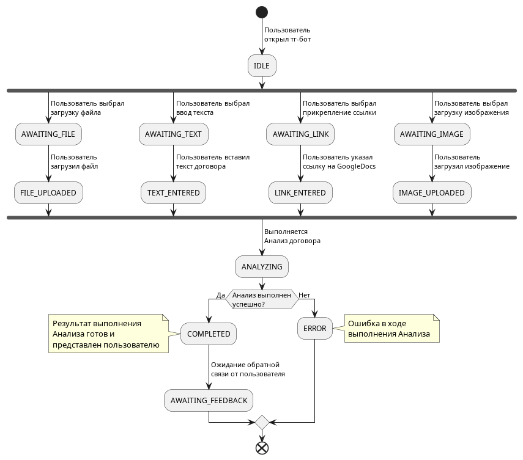

# Особенности конфигурирования Платформы

## Проектирование базы ключ-значение
### Назначение Redis в архитектуре
`Redis` выполняет следующие ключевые возможности:

| Возможности Redis | Описание | Требования |
|---|---|---|
|Управление состоянием сессий пользователя| - хранение текущего шага пользователя в Telegram-боте через FSM,  - отслеживание этапов загрузки документа и выполнения Анализа | - [ФТ-01](https://github.com/trofimovelijah/red-flag-analysis/issues/21),  - [ФТ-02](https://github.com/trofimovelijah/red-flag-analysis/issues/23),  - [ФТ-06](https://github.com/trofimovelijah/red-flag-analysis/issues/27),  - [ФТ-12](https://github.com/trofimovelijah/red-flag-analysis/issues/33),  - [ФТ-13](https://github.com/trofimovelijah/red-flag-analysis/issues/34),  - [ФТ-15](https://github.com/trofimovelijah/red-flag-analysis/issues/36),  - [ФТ-18](https://github.com/trofimovelijah/red-flag-analysis/issues/39),  - [ФТ-19](https://github.com/trofimovelijah/red-flag-analysis/issues/40),  - [ФТ-20](https://github.com/trofimovelijah/red-flag-analysis/issues/41) |
|Счётчик попыток на бесплатном тарифе| отслеживание количества использованных анализов (x/3) с TTL на сутки | - [ФТ-03](https://github.com/trofimovelijah/red-flag-analysis/issues/24),  - [ФТ-20](https://github.com/trofimovelijah/red-flag-analysis/issues/41),  - [ФТ-25](https://github.com/trofimovelijah/red-flag-analysis/issues/46) |
|Кэширование промежуточных данных| временное хранение метаданных загружаемых файлов, статусов обработки и результатов для быстрого доступа `n8n`-нодами | - [ФТ-07](https://github.com/trofimovelijah/red-flag-analysis/issues/28),  - [ФТ-08](https://github.com/trofimovelijah/red-flag-analysis/issues/29),  - [ФТ-11](https://github.com/trofimovelijah/red-flag-analysis/issues/32),  - [ФТ-14](https://github.com/trofimovelijah/red-flag-analysis/issues/35),  - [ФТ-24](https://github.com/trofimovelijah/red-flag-analysis/issues/45) |

### Распределение баз данных Redis

| DB | Назначение |	Описание |
|---|---|---|
| db0	| Сессии пользователей (FSM) | Состояние пользователя в Telegram-боте: текущий шаг, загружен ли файл, ожидание анализа |
| db1	| Счётчики лимитов | Количество использованных попыток анализа на бесплатном тарифе (`x/3`) |
| db2	| Кэш метаданных | Временные данные: метаданные файла, статус обработки, промежуточные результаты для `n8n` |

----
### Структура ключей Redis
Ниже описаны все ключи, их формат, тип данных и TTL. Имена ключей выбраны так, чтобы было легко отлаживать проблемы и находить нужные данные.

| Ключ | Тип | TTL, сек | Описание | Пример значения |
|---|---|---|---|---|
| **db0** |||||
| `session:{telegram_id}:state` | STRING | 3600 | Текущий шаг FSM пользователя | см. подробнее в *Таблице статусов FSM* |
| `session:{telegram_id}:data` | HASH | 3600 | Данные текущей сессии | file_name, file_size, file_format, upload_time, session_id |
| `session:{telegram_id}:lock` | STRING (SET NX) | 120 | Блокировка параллельных анализов от одного пользователя | 1 |
| **db1** |||||
| `limit:{telegram_id}:daily` | STRING (INCR) | До конца текущих суток (EXPIREAT на 23:59:59 MSK) | Счётчик использованных попыток за сутки | 0, 1, 2, 3 |
| `limit:{telegram_id}:tariff` | STRING | Без TTL (обновляется при смене тарифа) | Тип тарифа пользователя для быстрого доступа | FREE, PRO, PRO_PLUS |
| **db2** |||||
| `upload:{session_id}:meta` | HASH | 600 | Метаданные загруженного файла | s3_key, original_name, size_bytes, mime_type, has_text_layer |
| `analysis:{session_id}:status` | STRING | 300 | Статус выполнения анализа (для прогресс-бара) | см. *Таблицу статусов анализа* |
| `analysis:{session_id}:progress` | HASH | 300 | Прогресс анализа в процентах | percent: 45, stage: SEARCHING, elapsed_sec: 12 |
| `analysis:{session_id}:result` | STRING (JSON) | 1800 | Кэш результата анализа для выгрузки/повторного просмотра | JSON структурированного отчёта |

### Статусы FSM
Статусы описывают жизненный цикл пользовательской сессии в Тг-боте. Эти статусы используются как значения ключа `session:{telegram_id}:state`. Переходы между статусами отображены на диаграмме активностей. 

За исключением статуса `ANALYZING` все оставшиеся статусы могут следовать к `IDLE`. В целях удоства чтения на диаграмме это переходы не показаны. 

Перечень статусов `FSM` представлен в таблице

| Статус | Описание | Следующие статусы	| Действие |
|---|---|---|---|
| IDLE | Пользователь открыл бот, ничего не загрузил | → FILE_UPLOADED, TEXT_ENTERED, LINK_ENTERED | Ожидание ввода |
| FILE_UPLOADED	| Файл загружен в MinIO, проходит валидацию	| → ANALYZING, IDLE (при ошибке) | Запуск валидации формата и размера |
| TEXT_ENTERED | Пользователь вставил текст договора | → ANALYZING, IDLE (при ошибке) |Проверка длины (100–6000 символов)​ |
| LINK_ENTERED | Пользователь указал ссылку на Google Docs | → ANALYZING, IDLE (при ошибке) | Проверка доступности ссылки​ |
| ANALYZING	| Анализ выполняется (парсинг → чанкинг → поиск → LLM) | → RESULT_READY, FAILED | Обновление прогресс-бара каждые 2–3 сек |
| RESULT_READY | Результат готов и отображён пользователю | → AWAITING_FEEDBACK, IDLE |Активация кнопок «Выгрузить результат» и «Задать вопрос» |
| AWAITING_FEEDBACK	| Ожидание обратной связи (👍/👎) | → IDLE | Сохранение фидбэка в PostgreSQL |
| FAILED | Ошибка при анализе | → IDLE | Логирование ошибки, попытка не засчитывается |

### Статусы анализа (для прогресс-бара)

Статусы в ключе `analysis:{session_id}:status` отражают стадии пайплайна обработки.

| Статус | Прогресс, % | Описание |
|---|---|---|
| QUEUED | 0 |Запрос принят, ожидает обработки |
| PARSING | 10 | Парсинг документа, удаление артефактов вёрстки |
| CHUNKING | 25 | Разбиение текста на чанки |
| SEARCHING | 50 | Гибридный поиск: Qdrant (семантический) + PostgreSQL (BM25) |
| LLM_VERIFYING | 75 | LLM-верификация найденных рисков, отсев false positives |
| GENERATING_REPORT | 90 | Формирование структурированного отчёта |
| COMPLETED | 100 | Анализ завершён, результат готов |
| FAILED | | Ошибка на любом этапе |

## Проектирование файлового хранилища

`MinIO` выполняет функцию `S3`-совместимого объектного хранилища для временного размещения загруженных пользователем документов. Ключевое требование - транзитная обработка данных [ФТ-24](https://github.com/trofimovelijah/red-flag-analysis/issues/45) / [Без-1](https://github.com/trofimovelijah/red-flag-analysis/issues/61): документы должны обрабатываться и удаляться после завершения анализа. Основные возможности `MinIO`:

- буфер между загрузкой и обработкой - тг-бот принимает файл, сохраняет его в S3, в дальнейшем пайплайн (n8n-пайплайн) подхватывает его асинхронно,
- изоляция файлов по сессиям - каждый файл привязан к `session_id`, что исключает пересечения данных между пользователями,
- автоматическое удаление в соответствии с [ФТ-24](https://github.com/trofimovelijah/red-flag-analysis/issues/45) по TTL,
- единый интерфейс S3 API - n8n имеет встроенную ноду