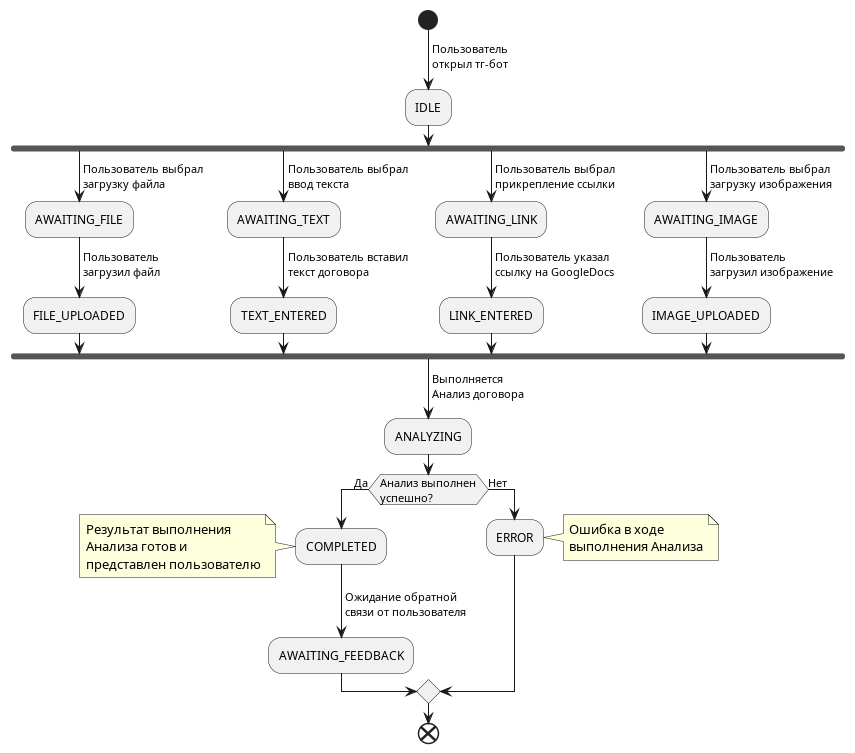

# Особенности конфигурирования Платформы

## Проектирование базы ключ-значение
### Назначение Redis в архитектуре
`Redis` выполняет следующие ключевые возможности:

| Возможности Redis | Описание | Требования |
|---|---|---|
|Управление состоянием сессий пользователя| - хранение текущего шага пользователя в Telegram-боте через FSM,<br> - отслеживание этапов загрузки документа и выполнения Анализа | - [ФТ-01](https://github.com/trofimovelijah/red-flag-analysis/issues/21),<br> - [ФТ-02](https://github.com/trofimovelijah/red-flag-analysis/issues/23),<br> - [ФТ-06](https://github.com/trofimovelijah/red-flag-analysis/issues/27),<br> - [ФТ-12](https://github.com/trofimovelijah/red-flag-analysis/issues/33),<br> - [ФТ-13](https://github.com/trofimovelijah/red-flag-analysis/issues/34),<br> - [ФТ-15](https://github.com/trofimovelijah/red-flag-analysis/issues/36),<br> - [ФТ-18](https://github.com/trofimovelijah/red-flag-analysis/issues/39),<br> - [ФТ-19](https://github.com/trofimovelijah/red-flag-analysis/issues/40),<br> - [ФТ-20](https://github.com/trofimovelijah/red-flag-analysis/issues/41) |
|Счётчик попыток на бесплатном тарифе| отслеживание количества использованных анализов (x/3) с TTL на сутки | - [ФТ-03](https://github.com/trofimovelijah/red-flag-analysis/issues/24),<br> - [ФТ-20](https://github.com/trofimovelijah/red-flag-analysis/issues/41),<br> - [ФТ-25](https://github.com/trofimovelijah/red-flag-analysis/issues/46) |
|Кэширование промежуточных данных| временное хранение метаданных загружаемых файлов, статусов обработки и результатов для быстрого доступа `n8n`-нодами | - [ФТ-07](https://github.com/trofimovelijah/red-flag-analysis/issues/28),<br> - [ФТ-08](https://github.com/trofimovelijah/red-flag-analysis/issues/29),<br> - [ФТ-11](https://github.com/trofimovelijah/red-flag-analysis/issues/32),<br> - [ФТ-14](https://github.com/trofimovelijah/red-flag-analysis/issues/35),<br> - [ФТ-24](https://github.com/trofimovelijah/red-flag-analysis/issues/45) |

### Распределение баз данных Redis

| DB | Назначение |	Описание |
|---|---|---|
| db0	| Сессии пользователей (FSM) | Состояние пользователя в Telegram-боте: текущий шаг, загружен ли файл, ожидание анализа |
| db1	| Счётчики лимитов | Количество использованных попыток анализа на бесплатном тарифе (`x/3`) |
| db2	| Кэш метаданных | Временные данные: метаданные файла, статус обработки, промежуточные результаты для `n8n` |

----
### Структура ключей Redis
Ниже описаны все ключи, их формат, тип данных и TTL. Имена ключей выбраны так, чтобы было легко отлаживать проблемы и находить нужные данные.

| Ключ | Тип | TTL, сек | Описание | Пример значения |
|---|---|---|---|---|
| **db0** |||||
| `session:{telegram_id}:state` | STRING | 3600 | Текущий шаг FSM пользователя | см. подробнее в *Таблице статусов FSM* |
| `session:{telegram_id}:data` | HASH | 3600 | Данные текущей сессии | file_name, file_size, file_format, upload_time, session_id |
| `session:{telegram_id}:lock` | STRING (SET NX) | 120 | Блокировка параллельных анализов от одного пользователя | 1 |
| **db1** |||||
| `limit:{telegram_id}:daily` | STRING (INCR) | До конца текущих суток (EXPIREAT на 23:59:59 MSK) | Счётчик использованных попыток за сутки | 0, 1, 2, 3 |
| `limit:{telegram_id}:tariff` | STRING | Без TTL (обновляется при смене тарифа) | Тип тарифа пользователя для быстрого доступа | FREE, PRO, PRO_PLUS |
| **db2** |||||
| `upload:{session_id}:meta` | HASH | 600 | Метаданные загруженного файла | s3_key, original_name, size_bytes, mime_type, has_text_layer |
| `analysis:{session_id}:status` | STRING | 300 | Статус выполнения анализа (для прогресс-бара) | см. *Таблицу статусов анализа* |
| `analysis:{session_id}:progress` | HASH | 300 | Прогресс анализа в процентах | percent: 45, stage: SEARCHING, elapsed_sec: 12 |
| `analysis:{session_id}:result` | STRING (JSON) | 1800 | Кэш результата анализа для выгрузки/повторного просмотра | JSON структурированного отчёта |
| `analysis:{session_id}:input`   | STRING | 600  | Файл договора в формате pdf/txt | пример.pdf |
| `input:{session_id}:text`   | STRING | 600  | Текст договора, введённый вручную | «Договор аренды от...»   |

### Статусы FSM
Статусы описывают жизненный цикл пользовательской сессии в Тг-боте. Эти статусы используются как значения ключа `session:{telegram_id}:state`. Переходы между статусами отображены на диаграмме активностей. 

[](../images/status_fsm.png)

Перечень статусов `FSM` представлен в таблице

| Статус | Описание | Переход из статуса	| Переход в статус |
|---|---|---|---|
| `IDLE` | Пользователь открыл бот, ничего не загрузил | начальное состояние | `AWAITING_TEXT`, `AWAITING_FILE` |
| `AWAITING_TEXT` | Ожидание ввода текста договора вручную | `IDLE` | `TEXT_ENTERED` |
| `AWAITING_FILE` | Ожидание загрузки файла (PDF/TXT) | `IDLE` | `FILE_UPLOADED` |
| `TEXT_ENTERED` | Текст получен и закэширован, готов к анализу | `AWAITING_TEXT` | `ANALYZING`​ |
| `FILE_UPLOADED`	| Файл загружен в MinIO, проходит валидацию	| `AWAITING_FILE` | `ANALYZING` |
| `LINK_ENTERED` | Пользователь указал ссылку на Google Docs | `AWAITING_LINK` | `ANALYZING`​ |
| `IMAGE_UPLOADED` | Загружено изображение/PDF (OCR) | `AWAITING_FILE` | `ANALYZING` |
| `ANALYZING`	| Анализ выполняется (парсинг → чанкинг → поиск → LLM) |`TEXT_ENTERED`, `FILE_UPLOADED`, `LINK_ENTERED`, `IMAGE_UPLOADED` | `COMPLETED`, `ERROR` |
| `COMPLETED` | Результат готов и отображён пользователю | `ANALYZING` | `AWAITING_FEEDBACK`, `IDLE` |
| `AWAITING_FEEDBACK`	| Ожидание обратной связи (👍/👎) | `COMPLETED` | `IDLE` |
| `ERROR` | Ошибка при анализе | любой | `IDLE` |

**Примечание:**
> Статусы `AWAITING_TEXT`, `AWAITING_FILE`, `TEXT_ENTERED`, 
> `FILE_UPLOADED` введены для поддержки FSM-логики inline-кнопок Telegram-бота. 
> Они обеспечивают корректную активацию кнопки «*🚀 Выполнить анализ*» только 
> после того, как пользователь предоставил данные для анализа.

### Статусы анализа (для прогресс-бара)

Статусы в ключе `analysis:{session_id}:status` отражают стадии пайплайна обработки.

| Статус | Прогресс, % | Описание |
|---|---|---|
| QUEUED | 0 |Запрос принят, ожидает обработки |
| PARSING | 10 | Парсинг документа, удаление артефактов вёрстки |
| CHUNKING | 25 | Разбиение текста на чанки |
| SEARCHING | 50 | Гибридный поиск: Qdrant (семантический) + PostgreSQL (BM25) |
| LLM_VERIFYING | 75 | LLM-верификация найденных рисков, отсев false positives |
| GENERATING_REPORT | 90 | Формирование структурированного отчёта |
| COMPLETED | 100 | Анализ завершён, результат готов |
| FAILED | | Ошибка на любом этапе |

### Команды для отладки и тестирования `Redis`

```bash
# удаление всех ключей только из текущей выбранной БД
redis-cli FLUSHDB
```

```bash
# удаление всех ключей только из текущей выбранной БД внутри docker-compose
docker compose exec -e REDISCLI_AUTH='твой пароль' redis redis-cli FLUSHDB
# или чисто через docker без compose
docker exec -e REDISCLI_AUTH='твой пароль' -it redis_db redis-cli FLUSHDB
```

```bash
# удаление ключей из всех существующих баз, а не только из текущей
redis-cli FLUSHALL
```

## Проектирование файлового хранилища

`MinIO` выполняет функцию `S3`-совместимого объектного хранилища для временного размещения загруженных пользователем документов. Ключевое требование - транзитная обработка данных [ФТ-24](https://github.com/trofimovelijah/red-flag-analysis/issues/45) / [Без-1](https://github.com/trofimovelijah/red-flag-analysis/issues/61): документы должны обрабатываться и удаляться после завершения анализа. Основные возможности `MinIO`:

- буфер между загрузкой и обработкой - тг-бот принимает файл, сохраняет его в S3, в дальнейшем пайплайн (n8n-пайплайн) подхватывает его асинхронно,
- изоляция файлов по сессиям - каждый файл привязан к `session_id`, что исключает пересечения данных между пользователями,
- автоматическое удаление в соответствии с [ФТ-24](https://github.com/trofimovelijah/red-flag-analysis/issues/45) по TTL,
- единый интерфейс S3 API - n8n имеет встроенную ноду.

### Структура бакетов

| Бакет | Назначение | Lifecycle (TTL) | Доступ |
|---|---|---|---|
| `user-uploads` | Загруженные пользователями файлы (*.pdf, *.txt, изображения) | 24 часа — автоматическое удаление | Запись: тг-бот; Чтение: n8n парсер |
| `analysis-reports` | Сгенерированные `PDF`/`TXT` отчёты для выгрузки пользователем | 7 дней — автоматическое удаление | Запись: n8n генератор отчётов; Чтение: тг-бот |

### Именование объектов

Объекты внутри бакетов именуются по единому шаблону для однозначной идентификации:
```json
{bucket}/{user_id}/{session_id}/{timestamp}_{original_filename}
```
Пример использования:
```json
user-uploads/42/sess_abc123/20260225_143000_contract.pdf
user-uploads/42/sess_abc123/20260225_143000_screenshot.png
analysis-reports/123456789/sess_abc123/20260225_143500_report.pdf
```

### Первоначальная настройка

После первого запуска [docker-compose.yaml](https://github.com/trofimovelijah/red-flag-analysis/blob/main/configuration/docker-compose.yaml) необходимо создать бакеты и настроить lifecycle-правила. Это делается через утилиту `mc` (MinIO Client).

**Шаг 0. Пароль**
Придумать пароль и прописать его в `.env`:
```bash
MINIO_ROOT_PASSWORD=YOUR_STRONG_MINIO_PASSWORD
```

**Шаг 1. Установка mc (на хост-машине или внутри контейнера)**

```bash
# Вариант А: скачать mc на хост-машину
wget https://dl.min.io/client/mc/release/linux-amd64/mc
chmod +x mc
sudo mv mc /usr/local/bin/

# Вариант Б: выполнить команды внутри контейнера
docker exec -it redflag-minio bash
```
Обратите внимание, что `mc` может быть уже присутствовать в качестве установленной как `Midnight Commander`. В этом случае запуск команд из оболочки ОС (не внутри контейнера) происходит через указание относительного пути. Пример: `./mc`

**Шаг 2. Регистрация подключения к серверу**

```bash
# «redflag» — произвольное имя alias для нашего MinIO-сервера
mc alias set redflag http://localhost:9000 redflag_admin YOUR_STRONG_MINIO_PASSWORD
```

**Шаг 3. Создание бакетов**

```bash
mc mb redflag/user-uploads
mc mb redflag/analysis-reports
```

**Шаг 4. Настройка lifecycle-правил (автоудаление файлов)**
Создайте файлы с правилами жизненного цикла:

`lifecycle-uploads.json` — удаление через 1 день
```json
{
  "Rules": [
    {
      "ID": "AutoDeleteUploads",
      "Status": "Enabled",
      "Expiration": {
        "Days": 1
      }
    }
  ]
}
```

`lifecycle-uploads.json` — удаление через 7 дней
```json
{
  "Rules": [
    {
      "ID": "AutoDeleteUploads",
      "Status": "Enabled",
      "Expiration": {
        "Days": 7
      }
    }
  ]
}
```

Применение правил:
```bash
mc ilm import redflag/user-uploads < lifecycle-uploads.json
mc ilm import redflag/analysis-reports < lifecycle-reports.json
```

**Шаг 5. Проверка настройки**
```bash
# Проверить список бакетов
mc ls redflag

[2026-03-02 13:45:29 UTC]     0B analysis-reports/
[2026-03-02 13:45:19 UTC]     0B user-uploads/

# Проверить lifecycle-правила
mc ilm ls redflag/user-uploads
┌────────────────────────────────────────────────────────────────────────────────────┐
│ Expiration for latest version (Expiration)                                         │
├───────────────────┬─────────┬────────┬──────┬────────────────┬─────────────────────┤
│ ID                │ STATUS  │ PREFIX │ TAGS │ DAYS TO EXPIRE │ EXPIRE DELETEMARKER │
├───────────────────┼─────────┼────────┼──────┼────────────────┼─────────────────────┤
│ AutoDeleteUploads │ Enabled │ -      │ -    │              1 │ false               │
└───────────────────┴─────────┴────────┴──────┴────────────────┴─────────────────────┘

mc ilm ls redflag/analysis-reports
┌────────────────────────────────────────────────────────────────────────────────────┐
│ Expiration for latest version (Expiration)                                         │
├───────────────────┬─────────┬────────┬──────┬────────────────┬─────────────────────┤
│ ID                │ STATUS  │ PREFIX │ TAGS │ DAYS TO EXPIRE │ EXPIRE DELETEMARKER │
├───────────────────┼─────────┼────────┼──────┼────────────────┼─────────────────────┤
│ AutoDeleteUploads │ Enabled │ -      │ -    │              7 │ false               │
└───────────────────┴─────────┴────────┴──────┴────────────────┴─────────────────────┘
```

### Создание сервисного аккаунта для `n8n`

**Шаг 1. Создание пользователя**

```bash
mc admin user add redflag n8n_service YOUR_N8N_SERVICE_PASSWORD
```

**Шаг 2. Создать файл политики**

Создать кастомную политику `n8n-policy.json`

```json
{
  "Version": "2012-10-17",
  "Statement": [
    {
      "Effect": "Allow",
      "Action": [
        "s3:PutObject",
        "s3:GetObject",
        "s3:DeleteObject",
        "s3:ListBucket"
      ],
      "Resource": [
        "arn:aws:s3:::user-uploads/*",
        "arn:aws:s3:::user-uploads",
        "arn:aws:s3:::analysis-reports/*",
        "arn:aws:s3:::analysis-reports"
      ]
    }
  ]
}
```

**Шаг 3. Выполнить действия с политикой**

Загрузить политику:

```bash
mc admin policy create redflag n8n-policy n8n-policy.json
```

Назначить политику пользователю:

```bash
mc admin policy attach redflag n8n-policy --user n8n_service
```

**Шаг 4. Выполнить проверку**

```bash
mc admin user info redflag n8n_service

AccessKey: n8n_service
Status: enabled
PolicyName: n8n-policy
MemberOf: []
```
