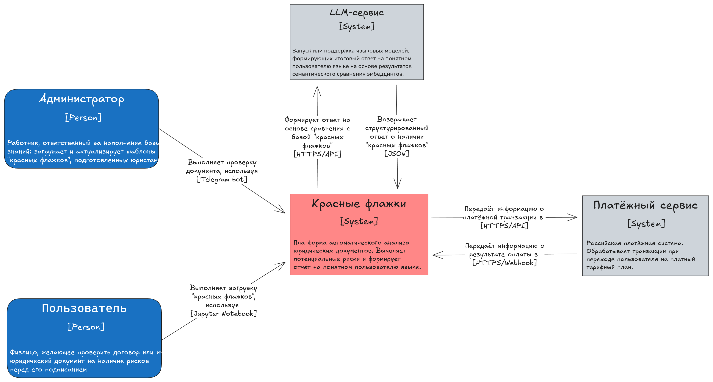
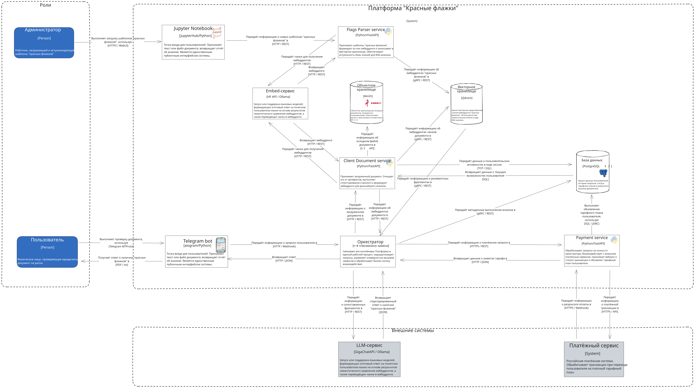

### Контекстная диаграмма архитектуры решения

Система "Красные флажки" взаимодействует со следующими внешними компонентами:

- **Telegram Bot API** — интерфейс взаимодействия с пользователями
- **LLM API** (OpenAI, YandexGPT, GigaChat) — анализ текста и генерация отчётов
- **Векторная база данных** (Qdrant) — хранение и поиск рисков
- **PostgreSQL** — реляционная база данных для метаданных
- **КонсультантПлюс API** — проверка актуальности законов
- **Платёжная система** — обработка платежей

### Диаграмма контейнеров архитектуры решения

Основные контейнеры системы:

1. **Telegram Bot** — фронтенд приложения
2. **n8n Orchestrator** — оркестратор рабочих процессов
3. **Parser Service** — парсинг документов, OCR
4. **Vector Store (Qdrant)** — векторное хранилище
5. **PostgreSQL** — реляционная база данных
6. **LLM Gateway** — прокси для работы с различными LLM
7. **Admin Panel** — административный интерфейс
