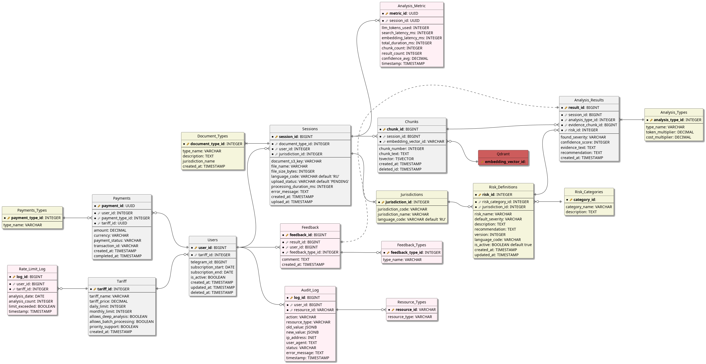

### Физическая модель реляционной базы данных

### Словарь данных реляционной базы данных

Словарь содержит описание всех полей для следующих таблиц:

1. Users (Пользователи)
2. Sessions (Сессии анализа)
3. Analysis_Results (Результаты анализа)
4. Chunks (Чанки)
5. Feedbacks (Обратная связь)
6. Risks (Риски)
7. Risk_Categories (Категории рисков)
8. Jurisdictions (Юрисдикции)
9. Document_Types (Типы документов)
10. Tariff (Тариф)
11. Payments (Платежи)
12. Payments_Types (Типы платежей)
13. Rate_Limit_Log (Отслеживание лимитов)

| Элемент данных | Описание | Тип данных | Длина | Значение |
| ----- | ----- | ----- | ----- | ----- |
| **Users (Пользователи)** | физическое лицо, достигшее 18 лет, имеющее доступ к телеграм-боту Платформы и выполняющее Анализ | PK: user_id  FK: tariff\_id |  |  |
| user\_id | Уникальный идентификатор пользователя в рамках Платформы | BIGINT | 10 |  |
| tariff\_id | Идентификатор тарифа пользователя | INTEGER  | 20 |  |
| telegram\_id | Идентификатор аккаунта Telegram | BIGINT | 20 |  |
| subscription\_start |  | DATE | 100 |  |
| subscription\_end |  | DATE | 20 |  |
| is\_active |  | BOOLEAN | 1 |  |
| created\_at | Дата и время создания аккаунта | TIMESTAMP | 19 | Не может быть позже текущей даты |
| updated\_at | Дата и время последнего обновления | TIMESTAMP | 19 | Не может быть раньше created\_at |
| deleted\_at |  | TIMESTAMP | 19 | Не может быть раньше created\_at |
| **Sessions (Сессии пользователя)** | сессии пользователя Платформы, во время которых осуществляется выполнение Анализа | PK: session\_id  FK: user\_id  FK: file\_format\_id  FK: jurisdiction\_id  FK: document\_type\_id |  |  |
| session\_id | Уникальный идентификатор активной сессии пользователя | BIGINT | 20 |  |
| user\_id | Ссылка на Users | BIGINT | 10 |  |
| document\_s3\_key | Идентификатор документа в S3 хранилище \- временный объект | VARCHAR | 255 |  |
| file\_name | Наименование загружаемого документа | VARCHAR | 255 |  |
| file\_size\_bytes | Размер загружаемого документа в байтах | INTEGER | 10 |  |
| document\_type\_id |  | INTEGER | 100 |  |
| jurisdiction\_id | Идентификатор юрисдикции | INTEGER | 20 |  |
| language\_code | Код языка | VARCHAR | 5 | RU (по-умолчанию) EN |
| upload\_status | Статус загрузки документа | VARCHAR | 20 | PENDING (по-умолчанию) PROCESSING COMPLETED FAILED |
| processing\_duration\_ms |  | INTEGER | 1 |  |
| error\_message | Сообщение об ошибке | TEXT | \- |  |
| created\_at |  | TIMESTAMP | 19 | DEFAULT CURRENT\_TIMESTAMP |
| updated\_at |  | TIMESTAMP | 19 | DEFAULT CURRENT\_TIMESTAMP |
| **Chunks (Чанки)** | Чанки для RAG и полнотекстового поиска | PK: chunk\_id   FK: session\_id   FK: embedding\_vector\_id |  |  |
| chunk\_id | Уникальный идентификатор чанка | BIGINT | 20 |  |
| session\_id | Уникальный идентификатор активной сессии пользователя | BIGINT | 20 |  |
| embedding\_vector\_id |  | VARCHAR | 100 |  Идентификатор в Qdrant |
| chunk\_number |  | INTEGER |  |  |
| chunk\_text |  | TEXT | 2000 |  |
| tsvector |  | TSVECTOR | 10 | для BM25 полнотекстового поиска |
| created\_at |  | TIMESTAMP | 19 | DEFAULT CURRENT\_TIMESTAMP |
| deleted\_at |  | TIMESTAMP | 19 | soft delete |
| **Analysis\_Results (Результаты Анализа)** | Результаты выполнения Анализа в рамках активной сессии пользователя | PK: result\_id  FK: session\_id  FK: risk\_id  FK: analysis\_type\_id  FK: evidence\_chunk\_id |  |  |
| result\_id | Уникальный идентификатор результата Анализа | BIGINT | 20 |  |
| session\_id | Уникальный идентификатор активной сессии пользователя | BIGINT | 20 |  |
| risk\_id | Идентификатор риска | INTEGER | 20 |  |
| analysis\_type\_id | Идентификатор типа анализа | INTEGER | 20 |  |
| evidence\_chunk\_id |  | BIGINT | 10 |  |
| found\_severity | Уровень риска  | VARCHAR | 20 | HIGH MEDIUM LOW |
| confidence\_score |  | INTEGER | 100 |  |
| evidence\_text | Цитата из документа, где найден риск | TEXT | 200 |  |
| recommendation | Специфичная рекомендация для документа | TEXT | 10000 |  |
| created\_at |  | TIMESTAMP | 19 | DEFAULT CURRENT\_TIMESTAMP |
| **Analysis\_Types (Типы Анализа)** | Справочник типов результатов Анализа | PK: analysis\_type\_id  |  |  |
| analysis\_type\_id | Уникальный идентификатор типа анализа | INTEGER | 20 |  |
| type\_name | Наименование типа | VARCHAR | 50 | STANDARD (по-умолчанию) DEEP |
| token\_multiplier |  | DECIMAL | 3, 1 | 1.0 \- для STANDARD 2.0 \- для DEEP |
| cost\_multiplier | Для расчёта стоимости | DECIMAL | 3, 1 | 1.0 \- по умолчанию |
| **Risk\_Definitions (Определение Рисков)** | Справочник определения рисков | PK: risk\_id  FK: risk\_category\_id  FK: jurisdiction\_id |  |  |
| risk\_id | Идентификатор риска | INTEGER | 20 |  |
| risk\_category\_id | Идентификатор категории рисков | INTEGER | 20 |  |
| jurisdiction\_id | Идентификатор юрисдикции | INTEGER | 20 |  |
| risk\_name |  | VARCHAR | 255 |  |
| default\_severity |  | VARCHAR | 20 | HIGH MEDIUM LOW |
| description | Описание  | TEXT | \- | не пустое |
| language\_code | Код языка | VARCHAR | 5 | RU (по-умолчанию) EN |
| version | Версия | INTEGER | 1 | 1 \- по-умолчанию |
| is\_active |  | BOOLEAN |  | True \- по-умолчанию |
| created\_at |  | TIMESTAMP | 19 | DEFAULT CURRENT\_TIMESTAMP |
| updated\_at |  | TIMESTAMP | 19 | DEFAULT CURRENT\_TIMESTAMP |
| **Risk\_Categories (Категории рисков)** | Справочник категорий рисков | PK: category\_id |  |  |
| category\_id | Идентификатор категории рисков | INTEGER | 20 |  |
| category\_name | Наименование категории | VARCHAR | 100 | Financial Legal Operational Compliance |
| description | Описание категории | TEXT |  |  |
| **Jurisdictions (Юрисдикция)** | Справочник юрисдикций | PK: jurisdiction\_id |  |  |
| jurisdiction\_id | Идентификатор юрисдикции | INTEGER | 20 |  |
| jurisdiction\_code | Код юрисдикции | VARCHAR | 20 | RF COMMON\_LAW EU OTHER |
| jurisdiction\_name | Наименование юрисдикции | VARCHAR | 100 |  |
| language\_code |  | VARCHAR | 5 | RU (по-умолчанию) EN |
| **Document\_Types  (Типы документов)** | Справочник типов документов | PK: document\_type\_id |  |  |
| document\_type\_id | Идентификатор типа документа | INTEGER | 100 |  |
| type\_name | Уникальное наименование типа документа | VARCHAR | 100 | CONTRACT NDA SLA EMPLOYMENT etc |
| description | Описание типа документа | TEXT |  |  |
| jurisdiction\_name | Наименование юрисдикции | VARCHAR | 100 |  |
| created\_at |  | TIMESTAMP | 19 | DEFAULT CURRENT\_TIMESTAMP |
| **Tariff (Тариф)** | Справочник тарифов | PK: tariff\_id |  |  |
| tariff\_id | Идентификатор тарифа пользователя | INTEGER | 20 |  |
| tariff\_name | Уникальное наименование тарифа | VARCHAR | 50 | FREE PRO PRO+ |
| tariff\_price |  | DECIMAL | 10, 2 | 0 299 599 |
| daily\_limit |  | INTEGER |  | 3 (Free) 0 (Pro, Pro+) |
| monthly\_limit |  | INTEGER |  |  |
| allows\_deep\_analysis |  | BOOLEAN |  | False (Free, Pro) True (Pro+) |
| allows\_batch\_processing |  | BOOLEAN |  | False (Free) True (Pro, Pro+) |
| priority\_support |  | BOOLEAN |  | False (Free, Pro) True (Pro+) |
| created\_at |  | TIMESTAMP | 19 | DEFAULT CURRENT\_TIMESTAMP |
| **Payments (Платежи)** | Платежи | PK: payment\_id  FK: user\_id  FK: payment\_type\_id  FK: tariff\_id |  |  |
| payment\_id | Уникальный идентификатор платежа | BIGINT |  |  |
| user\_id | Ссылка на Users | BIGINT | 10 |  |
| payment\_type\_id | Идентификатор типа платежа | INTEGER |  |  |
| tariff\_id | Идентификатор тарифа пользователя | INTEGER | 20 |  |
| amount | Сумма платежа | DECIMAL | 10, 2 |  |
| currency | Валюта платежа | VARCHAR | 3 | 'RUB' по умолчанию |
| payment\_status | Статус платежа | VARCHAR | 50 | PENDING COMPLETED FAILED REFUNDED |
| transaction\_id | Идентификатор транзакции | VARCHAR | 255 |  |
| created\_at |  | TIMESTAMP | 19 | DEFAULT CURRENT\_TIMESTAMP |
| completed\_at |  | TIMESTAMP |  |  |
| **Payments\_Types (Типы платежей)** | Типы платежей | PK: payment\_type\_id |  |  |
| payment\_type\_id | Идентификатор типа платежа | INTEGER |  |  |
| type\_name | Наименование типа платежа | VARCHAR | 100 | SUBSCRIPTION ONE\_TIME TOP\_UP |
| **Rate\_Limit\_Log (Отслеживание лимитов)** | Таблица для отслеживания лимитов на текущем тарифе пользователя | PK: log\_id  FK: user\_id  FK: tariff\_id |  |  |
| log\_id | Идентификатор лога | BIGINT |  |  |
| user\_id | Ссылка на Users | BIGINT | 10 |  |
| tariff\_id | Идентификатор тарифа пользователя | INTEGER | 20 |  |
| analysis\_date |  | DATE |  | не пустое |
| analysis\_count |  | INTEGER |  | по-умолчанию 0 |
| limit\_exceeded |  | BOOLEAN |  | False \- по-умолчанию |
| timestamp |  | TIMESTAMP | 19 | DEFAULT CURRENT\_TIMESTAMP |
| **Feedback (Обратная связь)** | Обратная связь от пользователя по результату выполнения Анализа | PK: feedback\_id  FK: result\_id  FK: user\_id  FK: feedback\_type\_id |  |  |
| feedback\_id | Идентификатор обратной связи | BIGINT | 20 |  |
| result\_id | Уникальный идентификатор результата Анализа | BIGINT | 20 |  |
| user\_id | Ссылка на Users | BIGINT | 10 |  |
| feedback\_type\_id | Идентификатор типа обратной связи | INTEGER | 10 |  |
| comment | Комментарий по обратной связи | TEXT |  | Необязательное |
| created\_at |  | TIMESTAMP | 19 | DEFAULT CURRENT\_TIMESTAMP |
| **Feedback\_Types** |  | PK: feedback\_type\_id |  |  |
| feedback\_type\_id | Идентификатор типа обратной связи | INTEGER | 10 |  |
| type\_name | Уникальное наименование типа обратной связи | VARCHAR | 50 | HELPFUL NOT\_HELPFUL NEEDS\_CLARIFICATION |
| **Audit\_Log** | Аудит и логирование | PK: log\_id  FK: user\_id  FK: resource\_id |  |  |
| log\_id | Идентификатор лога аудита | BIGINT | 20 |  |
| user\_id | Ссылка на Users | BIGINT | 10 |  |
| resource\_id | Идентификатор логируемого ресурса | VARCHAR | 100 |  |
| action | Действие пользователя, которое фиксируется в логах | VARCHAR | 100 | UPLOAD ANALYZE DOWNLOAD DELETE LOGIN LOGOUT |
| old\_value |  | JSONB |  |  |
| new\_value |  | JSONB |  |  |
| ip\_address |  | INET |  |  |
| user\_agent |  | TEXT |  |  |
| status | Статус | VARCHAR | 20 | SUCCESS \- по умолчанию FAILED |
| error\_message | Сообщение об ошибке | TEXT |  |  |
| timestamp |  | TIMESTAMP | 19 | DEFAULT CURRENT\_TIMESTAMP |
| **Resource\_Types (Типы ресурсов)** | Типы ресурсов, выявленных в ходе логирования | PK: resource\_id |  |  |
| resource\_id | Идентификатор логируемого ресурса | VARCHAR | 100 |  |
| resource\_type | Тип логируемого ресурса | VARCHAR | 100 | SESSION RESULT USER CHUNK |
| **Analysis\_Metric** | Метрики производительности | PK: metric\_id  FK: session\_id |  |  |
| metric\_id | Идентификатор метрики | BIGINT | 20 |  |
| session\_id | Уникальный идентификатор активной сессии пользователя | BIGINT | 20 |  |
| llm\_tokens\_used |  | INTEGER |  |  |
| search\_latency\_ms |  | INTEGER |  |  |
| embedding\_latency\_ms |  | INTEGER |  |  |
| total\_duration\_ms |  | INTEGER |  |  |
| chunk\_count |  | INTEGER |  |  |
| result\_count |  | INTEGER |  |  |
| confidence\_avg |  | DECIMAL | 5, 2 |  |
| timestamp |  | TIMESTAMP | 19 | DEFAULT CURRENT\_TIMESTAMP |

### Исследование векторного хранилища

#### Сбор требований
К реализации требований к векторному хранилищу можно отнести указанные ниже моменты.

{{ github_req_full(76) }}

----

{{ github_req_full(77) }}

----

{{ github_req_full(78) }}

----

{{ github_req_full(79) }}

----

{{ github_req_full(80) }}

----

{{ github_req(81) }}

----

{{ github_req(82) }}

----

{{ github_req(83) }}

----

{{ github_req_full(84) }}

----

#### Выбор стратегии индексирования
После создания чанков в реляционной БД необходимо выполнять индексирование. Это связано с процессом загрузки данных. Процесс выглядит следующим образом:

1. Чанк загружается из *chunks* таблицы  
2. Текст преобразуется в эмбеддинг (BERT, 768-1024 размерность)  
3. Эмбеддинг сохраняется в *vector\_documents* векторного хранилища  
4. Статус обновляется → INDEXED  
5. Индекс HNSW инкрементально перестраивается

При выборе стратегии индексирования опираемся на таблицу.

| Объем | Latency | Recall | Алгоритм | Параметры | Метрика |
| ----- | ----- | ----- | ----- | ----- | ----- |
| < 1M | < 50ms | ≥95% | HNSW | M=16, ef=200, search=40 | косинусное сходство |
| 1-100M | < 100ms | ≥90% | IVF | nlist=1024, nprobe=32 | косинусное сходство |
| > 100M | < 200ms | ≥85% | Гибридный | IVF коарс \+ HNSW файн |  |

#### Расчёт ёмкости и ресурсов

1. Расчёт рекомендуемой RAM для Qdrant:

   *память \= количество\_векторов × размерность × размер одного вектора в float32*  
   *4096 Мб \= 1000000 × 1024 × 4 байта*

2. С индексом HSWF:

	*память\_с\_индексом \= память × 1.5*  
    *6144 Мб \= 4096 Мб × 1.5*

3. С репликацией:  
   *итого \= память\_с\_индексом × 3*  
   *18,4 Гб \= 6144 Мб  × 3*  
     
4. С метаданными:  
   *все\_вместе \= итого \+ метаданные*  
   *19,7 Гб \= 18,4 Гб \+ (4096 Мб × 30%)*

#### Проектирование схемы данных

Типичная схема векторного хранилища состоит из компонентов:

- первичный ключ,
- скалярные поля,
- формат метаданных,
- тип векторов.

Реализация представлена в таблице

| Элемент данных | Описание | Тип данных | Длина | Значение | Связь с таблицей реляционной БД |
| ----- | ----- | ----- | ----- | ----- | ----- |
| **ru_vector_documents** | Таблица “красных флажков” в векторном хранилище | PK: document\_vector\_id  FK: chunk\_id  FK: session\_id  FK: user\_id |  |  |  |
| document\_vector\_id |  | UUID |  |  |  |
| chunk\_id |  | INTEGER |  |  | chunks.chunk\_id |
| session\_id |  | INTEGER |  |  | sessions.session\_id |
| user\_id |  | INTEGER |  |  | users.user\_id |
|  | **Векторные данные** |  |  |  |  |
| embedding | Векторные данные | DenseVector | 768-1024 |  | float32 |
| embedding\_model | Модель встраивания | VARCHAR | \- |  |  |
| embedding\_timestamp |  | TIMESTAMP | 19 |  |  |
|  | **Текстовые данные** |  |  |  |  |
| chunk\_text | Текстовые данные | TEXT | 5000 |  |  |
| chunk\_summary | Текстовые данные | VARCHAR | 500 |  |  |
| **metadata** | JSON payload  | title source\_url created\_date category language |  |  |  |
| document\_title |  | VARCHAR | 255 |  |  |
| document\_type |  | VARCHAR | 50 | CONTRACT NDA etc |  |
| source\_url |  | VARCHAR | 512 |  |  |
| category |  | VARCHAR | 50 | Legal Financial etc |  |
| language\_code |  | VARCHAR | 5 | RU EN etc |  |
| jurisdiction |  | VARCHAR | 10 | RF US EU etc |  |
| created\_date |  | TIMESTAMP | 19 |  |  |
| processing\_date |  | TIMESTAMP | 19 |  |  |
| ttl\_expires\_at | Удаление через 90 дней | TIMESTAMP |  |  |  |
|  | **Индексы поиска** |  |  |  |  |
| HNSW-индекс |  |  |  |  | для embedding |
| BTree-индекс |  |  |  |  | для chunk\_id, session\_id, user\_id |
| Full-text-индекс |  |  |  |  | для chunk\_text |
|  | **Служебные поля** |  |  |  |  |
| indexing\_status |  | VARCHAR |  | PENDING INDEXED FAILED |  |
| relevance\_score | усредненный score | DECIMAL |  |  |  |
| is\_active | актуальность для поиска   | BOOLEAN |  |  |  |
| created\_at |  | TIMESTAMP | 19 |  |  |
| updated\_at |  | TIMESTAMP | 19 |  |  |
| **Vector\_search\_log** | Таблица поисковых запросов в векторном хранилище | PK: search\_id  FK: session\_id  FK: user\_id  FK: result\_id |  |  |  |
| search\_id |  |  |  |  |  |
| session\_id |  |  |  |  |  |
| user\_id |  |  |  |  |  |
| result\_id |  |  |  |  |  |
|  | **Параметры поиска** |  |  |  |  |
| query\_text |  | TEXT |  |  |  |
| query\_embedding |  | DenseVector | 768-1024 |  |  |
| query\_type |  | VARCHAR |  | RAG\_CONTEXT SIMILARITY etc |  |
| top\_k | кол-во возвращаемых результатов | INTEGER |  |  |  |
| similarity\_threshold |  | DECIMAL |  | 0,72-0,80 |  |
|  | **Результаты поиска** |  |  |  |  |
| matched\_chunks |  | JSONB array |  |  |  |
| match\_scores |  | DECIMAL array |  |  |  |
| matched\_count |  | INTEGER |  |  |  |
| search\_latency\_ms |  | INTEGER |  |  |  |
|  | **Служебные поля** |  |  | SUCCESS FAILED TIMEOUT |  |
| status |  | VARCHAR |  |  |  |
| error\_message |  | TEXT |  |  |  |
| created\_at |  | TIMESTAMP |  |  |  |

Общая информация о коллекции:

* Название: ru_documents_embeddings  
* Назначение: хранение эмбеддингов документов для RAG  
* Объем: 1M текущих, 5M через год  
* TTL: 90 дней